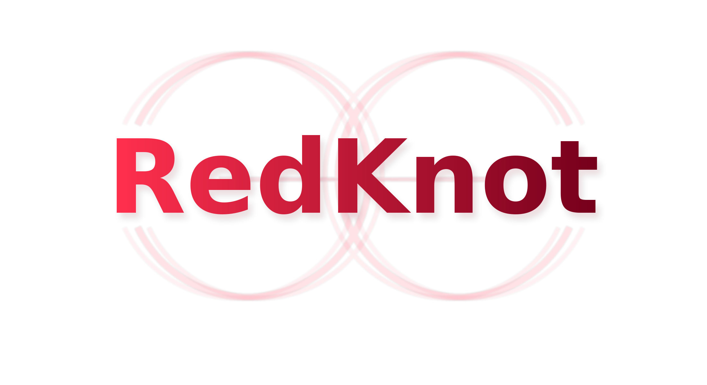

<div align="center" id="redknottop">
</img>

**Head-Classified KV Reuse + Elastic Sparsity for Long-Context LLM Inference**

[](https://github.com/sgl-project/sglang)
[](./LICENSE)
[]()

</div>

--------------------------------------------------------------------------------

## About

**RedKnot** is a long-context inference acceleration integration built on top of [SGLang](https://github.com/sgl-project/sglang). Its core idea is: **not every attention head needs the full KV, and not every token needs to go through the full FFN**. RedKnot achieves this through:

- **Head Classification**: each `(layer, kv_head)` is categorized into one of four classes — `global / local / retrieval / dense` — and the KV storage and reuse strategy is decided per class;
- **Offline KV Reuse + RoPE Relocation**: KV for reusable segments is stored offline; at serving time only the necessary tokens are selectively recomputed, and RoPE relocation guarantees numerical alignment;
- **Elastic Sparsity / Sparse FFN**: token-selective FFN based on attention importance, skipping the feed-forward computation for low-contribution tokens;
- **SegPagedAttention Runtime**: per-head page table + segmented KV store, allowing different head classes to have different visible windows;
- **DeepSeek-V4** and the **full Qwen 3.5 series** will be fully updated and adapted in the next release; only the base version is open-sourced for now.

While staying at **near-lossless accuracy** (in some scenarios even better than the dense baseline), it reduces long-context prefill **FLOPs by roughly 50%–70%** and delivers **1.35x–2.2x TTFT speedup** (the gains grow larger as context length increases).

- **Paper**: **RedKnot: Efficient Long-Context LLM Serving with Head-Aware KV Reuse and SegPagedAttention** — Yang Liu, ZhaoKai Luo, HuaYi Jin, ZhiYong Wang, RuoZhou He, BoYu Wang, Guanjie Chen, Junhao Hu (<https://arxiv.org/abs/2606.06256>)

> This repository is built on SGLang and retains all of SGLang's high-performance serving capabilities (RadixAttention, zero-overhead scheduler, PD disaggregation, continuous batching, quantization, etc.). RedKnot is integrated as an attention-layer extension under `python/sglang/srt/layers/attention/redknot/`.

## Key Ideas

| Mechanism | Description | Code Location |
|---|---|---|
| Head classification config | `global / local / retrieval / dense` four-class strategy + JSON loading | `redknot/head_config.py`, `head_profiler.py` |
| Offline KV cache + RoPE relocation | Segment-level offline KV storage and relocation (numerical alignment) | `redknot/offline_cache.py`, `rope_helper.py` |
| Head-aware attention recovery | FlashAttention-2 / FA-3 bucketed attention | `redknot/ops_flash.py`, `ops_flash3.py` |
| Sparse FFN (Elastic Sparsity) | Token-selective FFN, skipping computation by importance | `redknot/sparse_ffn.py` |
| SegPagedAttention runtime | Per-head page table + segmented KV store | `redknot/segpaged.py`, `segpaged_v2/` |
| DeepSeek-V4 MLA integration | Reuse indexer top-k for selective recomputation | `redknot/deepseek_v4_mla.py`, `dsv4_offline_reuse.py` |
| PD KV transfer / head-aware scheduling | Head-class KV shard transfer and capacity model | `redknot/pd_transfer.py`, `scheduler.py` |

See `python/sglang/srt/layers/attention/redknot/ROADMAP.md` for a more detailed phase plan.

## Getting Started

RedKnot reuses SGLang's installation flow:

```bash
# Install (development mode)
pip install -e "python[all]"
```

Some models (the `qwen3_5_moe` architecture of `Qwen3.5-*`, and `DeepSeek-V4`) require transformers 5.x.
The repository ships with `.venv_tf5` (transformers 5.12.0). The system transformers 4.57 cannot load these models.

- Install: <https://docs.sglang.io/get_started/install.html>
- Quick start: <https://docs.sglang.io/basic_usage/send_request.html>

## Benchmarks (RAG Accuracy / Speed)

All benchmark scripts live in `test/srt/redknot/`; the accompanying scripts, plots, and docs are archived under `test/srt/redknot/utils/`.
Each benchmark uses an **honest dense baseline** (one full FlashAttention-2 prefill) to compare against RedKnot's head-class KV reuse path, reporting accuracy (SQuAD F1 / EM), speed (TTFT, speedup, decode tok/s), and background overhead.

> Hardware: NVIDIA L20Y ×8 (80GB each) | 4 samples per model | Date: 2026-06-26

### Qwen3-32B — HotpotQA ✅ Best

| Context | base F1 | RedKnot F1 | base TTFT | RedKnot TTFT | speedup | FLOPs saved |
|---|---|---|---|---|---|---|
| 16K | 0.750 | **1.000** | 3.24s | 2.33s | **1.39x** | 69.2% |
| 24K | 1.000 | **1.000** | 5.25s | 2.96s | **1.77x** | 70.9% |
| 32K | 0.750 | **1.000** | 7.74s | 4.02s | **1.93x** | 72.2% |

RedKnot F1 is **always ≥ baseline** (lossless or better), TTFT speedup grows with context (1.39→1.93x), and FLOPs savings stay stable at ~70%.

### Qwen3.5-35B-A3B (MoE) — LongBench

| Context | Dataset | std F1 | RedKnot F1 | compute saved | TTFT speedup |
|---|---|---|---|---|---|
| 16K | triviaqa | 1.000 | 1.000 | 46.4% | **1.87x** |
| 32K | multifieldqa_en | 0.792 | 0.576 | 50.4% | **2.02x** |
| 64K | triviaqa | 0.875 | 0.750 | 53.8% | **2.16x** |

TTFT speedup grows with context (1.87→2.16x); lossless at 16K, with some degradation at long context (the cost of linear attention + MoE sparsity).

### Mistral-7B-Instruct-v0.3 — HotpotQA

| Context | base F1 | RedKnot F1 | base TTFT | RedKnot TTFT | speedup | FLOPs saved |
|---|---|---|---|---|---|---|
| 16K | 0.250 | 0.475 | 0.70s | 0.52s | **1.35x** | 51.5% |
| 24K | 0.250 | 0.250 | 1.12s | 0.80s | **1.39x** | 50.2% |
| 32K | 0.688 | 0.100 | 1.67s | 1.24s | **1.35x** | 49.1% |

For this small 7B model, the baseline itself is weak on long-context RAG and F1 is noisy; the system metrics (TTFT speedup ~1.35x / FLOPs savings ~50%) remain stable.

### Known Issues

- **Llama-3.3-70B-Instruct**: the baseline works normally, but the RedKnot decode path degrades (repeated tokens) under long-context LongBench, and single-GPU INT4 easily OOMs while multi-GPU bf16 triggers cross-device errors. This is a pre-existing algorithm/config issue of RedKnot on Llama3.3, pending a separate investigation into `driver_batched` Llama compatibility and the quality of the `head_class/llama-70B_*.json` configs.

## How to Run

Benchmark scripts are all located in `test/srt/redknot/`. At runtime they depend on the `head_class/`, `sparse_ffn_params/`, and `datasets/` config/data directories in the same folder, as well as `utils/` (e.g. `fp8_offline_patch.py`).

### One-command reproduction

```bash
cd test/srt/redknot

# Default small/medium models (Mistral/Qwen3 on HotpotQA + Llama/Qwen35 on LongBench)
bash run_all_rag.sh

# Custom models and sizes
RK_MODELS="mistral qwen3" RK_SAMPLES=4 RK_LENGTHS=16K,24K,32K \
  bash run_all_rag.sh
```

### Run all RAG benchmarks

Run the RAG benchmarks for all five models in sequence (Qwen3.5-MoE / Qwen3 / Mistral / Llama3.3 / DeepSeek-V4):

```bash
cd test/srt/redknot

python benchmark_RedKnot_Qwen35_RAG.py
python benchmark_RedKnot_Qwen3_RAG.py
python benchmark_RedKnot_Mistral_RAG.py
python benchmark_RedKnot_Llama3.3_RAG.py
python benchmark_RedKnot_DeepSeekV4_RAG.py
```

> Note: `Qwen3.5-MoE` and `DeepSeek-V4` require transformers 5.x; run the corresponding scripts with `.venv_tf5/bin/python`.

### Minimal single-model check (results in a few minutes)

```bash
# Qwen3-32B (INT4 NF4, single GPU)
REDKNOT_N_SAMPLES=1 REDKNOT_LENGTHS=16K REDKNOT_MAX_NEW=8 \
  CUDA_VISIBLE_DEVICES=0 python test/srt/redknot/benchmark_RedKnot_Qwen3_RAG.py

# Qwen3.5-35B-A3B / Qwen3.5-397B-A17B (MoE, requires transformers 5, use .venv_tf5)
PYTORCH_CUDA_ALLOC_CONF=expandable_segments:True HF_HUB_OFFLINE=1 \
REDKNOT_N_SAMPLES=1 REDKNOT_MAX_NEW=8 CUDA_VISIBLE_DEVICES=0,1 \
  .venv_tf5/bin/python test/srt/redknot/benchmark_RedKnot_Qwen35_397B_RAG.py

# Mistral-7B-Instruct-v0.3 (bf16, single GPU)
REDKNOT_N_SAMPLES=4 CUDA_VISIBLE_DEVICES=0 \
  python test/srt/redknot/benchmark_RedKnot_Mistral_RAG.py

# Llama-3.3-70B-Instruct (INT4 NF4, single GPU)
REDKNOT_N_SAMPLES=3 CUDA_VISIBLE_DEVICES=0 \
  python test/srt/redknot/benchmark_RedKnot_Llama3.3_RAG.py

# DeepSeek-V4 (MLA + indexer, requires large VRAM / .venv_tf5)
CUDA_VISIBLE_DEVICES=0 \
  .venv_tf5/bin/python test/srt/redknot/benchmark_RedKnot_DeepSeekV4_RAG.py
```

### Key environment variables

| Variable | Description |
|---|---|
| `REDKNOT_N_SAMPLES` | Number of evaluation samples |
| `REDKNOT_LENGTHS` | Context lengths (HotpotQA models, e.g. `16K,24K,32K`) |
| `REDKNOT_DATASETS` | LongBench datasets (LongBench models) |
| `REDKNOT_MAX_NEW` | Maximum number of generated tokens |
| `REDKNOT_DTYPE` | `int4` or `bf16` |
| `REDKNOT_COMPILE` | Whether to enable `torch.compile` (`0`/`1`) |
| `CUDA_VISIBLE_DEVICES` | Visible GPUs |

All run logs are saved under `test/srt/redknot/rag_logs/`.

## Acknowledgment

RedKnot is built on top of [SGLang](https://github.com/sgl-project/sglang) and reuses designs and implementations from many projects in its ecosystem:
- [SGLang](https://github.com/sgl-project/sglang)
- [vLLM](https://github.com/vllm-project/vllm)
